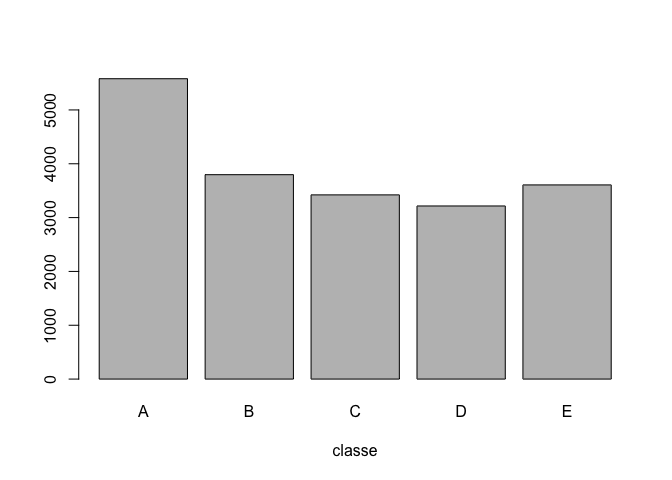

# Practical Machine Learning Course Project
Annie O.  
September, 2015  


## Overview 

Using devices such as Jawbone Up, Nike FuelBand, and Fitbit it is now possible to collect a large amount of data about personal activity relatively inexpensively. These type of devices are part of the quantified self movement – a group of enthusiasts who take measurements about themselves regularly to improve their health, to find patterns in their behavior, or because they are tech geeks. One thing that people regularly do is quantify how much of a particular activity they do, but they rarely quantify how well they do it. 

In this project, will be to use data from accelerometers on the belt, forearm, arm, and dumbell of 6 participants. They were asked to perform barbell lifts correctly and incorrectly in 5 different ways. The goal is to predict the manner in which they did the exercise. 

The data for this project come from the source: http://groupware.les.inf.puc-rio.br/har (see the section on the Weight Lifting Exercise Dataset).   
 
  
 
## Data Processing  
 
The data for this analysis is in the form of comma separated csv file, and can download from the web site:  
 
- the training data 
https://d396qusza40orc.cloudfront.net/predmachlearn/pml-training.csv

- the test data
https://d396qusza40orc.cloudfront.net/predmachlearn/pml-testing.csv

Before data processing, load the required R libraries.

```r
library(caret)
library(ggplot2)
```
  
Download the data files into your working directory. 

```r
#download.file("https://d396qusza40orc.cloudfront.net/predmachlearn/pml-training.csv", destfile = "pml-training.csv", method="curl")
#download.file("https://d396qusza40orc.cloudfront.net/predmachlearn/pml-testing.csv", destfile = "pml-testing.csv", method="curl")
```
Load the data files.

```r
trainData <- read.csv("pml-training.csv")
testData <- read.csv("pml-testing.csv")
```

Review the data files.

```r
dim(trainData)
```

```
## [1] 19622   160
```

```r
dim(testData)
```

```
## [1]  20 160
```

```r
unique(trainData$classe)
```

```
## [1] A B C D E
## Levels: A B C D E
```
   
- the training data set contains 19622 observations and 160 variables,  
- the testing data set contains 20 observations and 160 variables.   

The "classe" variable in the training set is the outcome to predict. The variable has 5 levels: A, B, C, D, and E.  
 
Clean the data files. 

```r
# remove NA columns
trainNA <- trainData[, colSums(is.na(trainData)) == 0] 
testNA <- testData[, colSums(is.na(testData)) == 0] 
  
# select relavant columns - belt, forearm, arm, and dumbdell 
trainSel <- grepl("belt|arm|dumbbell", names(trainNA))
trainClean <- trainNA[, trainSel]
trainClean <- trainClean[, sapply(trainClean, is.numeric)]
trainClean$classe <- trainNA$classe

testSel <- grepl("belt|arm|dumbbell", names(testNA))
testClean <- testNA[, testSel]
testClean <- testClean[, sapply(testClean, is.numeric)]

dim(trainClean)
```

```
## [1] 19622    53
```

```r
dim(testClean)
```

```
## [1] 20 52
```

```r
names(trainClean)
```

```
##  [1] "roll_belt"            "pitch_belt"           "yaw_belt"            
##  [4] "total_accel_belt"     "gyros_belt_x"         "gyros_belt_y"        
##  [7] "gyros_belt_z"         "accel_belt_x"         "accel_belt_y"        
## [10] "accel_belt_z"         "magnet_belt_x"        "magnet_belt_y"       
## [13] "magnet_belt_z"        "roll_arm"             "pitch_arm"           
## [16] "yaw_arm"              "total_accel_arm"      "gyros_arm_x"         
## [19] "gyros_arm_y"          "gyros_arm_z"          "accel_arm_x"         
## [22] "accel_arm_y"          "accel_arm_z"          "magnet_arm_x"        
## [25] "magnet_arm_y"         "magnet_arm_z"         "roll_dumbbell"       
## [28] "pitch_dumbbell"       "yaw_dumbbell"         "total_accel_dumbbell"
## [31] "gyros_dumbbell_x"     "gyros_dumbbell_y"     "gyros_dumbbell_z"    
## [34] "accel_dumbbell_x"     "accel_dumbbell_y"     "accel_dumbbell_z"    
## [37] "magnet_dumbbell_x"    "magnet_dumbbell_y"    "magnet_dumbbell_z"   
## [40] "roll_forearm"         "pitch_forearm"        "yaw_forearm"         
## [43] "total_accel_forearm"  "gyros_forearm_x"      "gyros_forearm_y"     
## [46] "gyros_forearm_z"      "accel_forearm_x"      "accel_forearm_y"     
## [49] "accel_forearm_z"      "magnet_forearm_x"     "magnet_forearm_y"    
## [52] "magnet_forearm_z"     "classe"
```
After cleaned the data (by removing NA columns and selective columns): 

- the training data set contains 19622 observations and 53 variables, 
- the testing data set contains 20 observations and 52 variables.   

Plot the graph: total observations by classe: 

```r
plot(trainClean$classe, xlab = "classe")
```

 

```r
table(trainClean$classe)
```

```
## 
##    A    B    C    D    E 
## 5580 3797 3422 3216 3607
```


## Model Based Prediction
**Random Forests** model is used for the prediction.  One main advantage of using this model is high accuracy. However, this model prediction is taking long time to process. 
  
#### Data slicing 
Create training and test sets - using cleaned data and split into 70% training data set and 30% validation data set.

```r
#for reproduce purpose
set.seed(1234) 

inTrain <- createDataPartition(trainClean$classe, p=0.70, list=FALSE)
trainD <- trainClean[inTrain, ]
testD <- trainClean[-inTrain, ]

dim(trainD)
```

```
## [1] 13737    53
```

```r
dim(testD)
```

```
## [1] 5885   53
```
 
#### Build Predictions  
For the prediction algorithm, 2-fold cross validation rules is selected.
 

```r
ctrlRF <- trainControl(method="cv", 2)
modelRF <- train(classe ~., method="rf", data=trainD, trControl=ctrlRF)
modelRF
```

```
## Random Forest 
## 
## 13737 samples
##    52 predictor
##     5 classes: 'A', 'B', 'C', 'D', 'E' 
## 
## No pre-processing
## Resampling: Cross-Validated (2 fold) 
## Summary of sample sizes: 6869, 6868 
## Resampling results across tuning parameters:
## 
##   mtry  Accuracy   Kappa      Accuracy SD  Kappa SD   
##    2    0.9823835  0.9777101  0.003498460  0.004426680
##   27    0.9844217  0.9802900  0.001233787  0.001561785
##   52    0.9796901  0.9743026  0.004218828  0.005342189
## 
## Accuracy was used to select the optimal model using  the largest value.
## The final value used for the model was mtry = 27.
```

Predict the data with validation data set (30% of cleaned data) 

```r
predA <-predict(modelRF, testD)

confusionMatrix(testD$classe, predA)
```

```
## Confusion Matrix and Statistics
## 
##           Reference
## Prediction    A    B    C    D    E
##          A 1674    0    0    0    0
##          B   12 1126    1    0    0
##          C    0    4 1018    4    0
##          D    0    2    6  954    2
##          E    0    1    2    3 1076
## 
## Overall Statistics
##                                           
##                Accuracy : 0.9937          
##                  95% CI : (0.9913, 0.9956)
##     No Information Rate : 0.2865          
##     P-Value [Acc > NIR] : < 2.2e-16       
##                                           
##                   Kappa : 0.992           
##  Mcnemar's Test P-Value : NA              
## 
## Statistics by Class:
## 
##                      Class: A Class: B Class: C Class: D Class: E
## Sensitivity            0.9929   0.9938   0.9912   0.9927   0.9981
## Specificity            1.0000   0.9973   0.9984   0.9980   0.9988
## Pos Pred Value         1.0000   0.9886   0.9922   0.9896   0.9945
## Neg Pred Value         0.9972   0.9985   0.9981   0.9986   0.9996
## Prevalence             0.2865   0.1925   0.1745   0.1633   0.1832
## Detection Rate         0.2845   0.1913   0.1730   0.1621   0.1828
## Detection Prevalence   0.2845   0.1935   0.1743   0.1638   0.1839
## Balanced Accuracy      0.9964   0.9955   0.9948   0.9953   0.9984
```

Estimate Accuracy and Sample Error 

```r
# Accuracy
accuracy <- postResample(predA, testD$classe) * 100
accuracy
```

```
## Accuracy    Kappa 
## 99.37128 99.20455
```

```r
# Sample error
error <- (1 - confusionMatrix(testD$classe, predA)$overall[1]) * 100
error 
```

```
##  Accuracy 
## 0.6287171
```

#### Results 
- the estimate accuracy from the model is 99.37%
- the expected sample error from the model is 0.63%
   
  
## Prediction using Test Data file   

Using the cleaned test data file for this purpose.

```r
predT <-predict(modelRF, testClean)
predT
```

```
##  [1] B A B A A E D B A A B C B A E E A B B B
## Levels: A B C D E
```

#### Generate submission to Coursera 

```r
answers <- predT

pml_write_files = function(x){
  n = length(x)
  for(i in 1:n){
    filename = paste0("problem_id_",i,".txt")
    write.table(x[i],file=filename,quote=FALSE,row.names=FALSE,col.names=FALSE)
  }
}

pml_write_files(answers)
```
 
